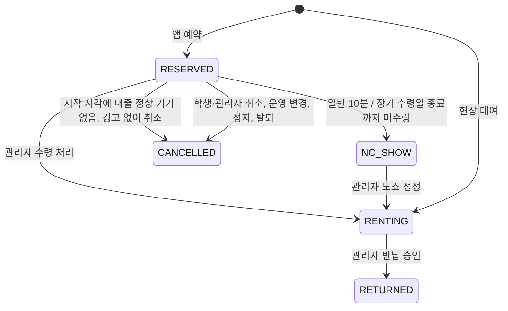

# DB 설계

서버가 데이터를 **어떤 표에 어떻게 저장하는지**, 그리고 **대여 기록의 상태가 언제 어떻게 바뀌는지**를 정한 문서입니다. 상태가 바뀌는 규칙의 기준은 이 문서이고, [API 명세](../api/README.md)는 "어떤 API가 이 전이를 일으키는지"만 연결합니다.

- 기능 규칙의 근거: [기획안](../design/기획안.md) (이하 "기획안 N장")
- DB: MySQL 9.7, AWS EC2 안에 설치, RDS는 쓰지 않음 (확정, [외부 연결 6절](../외부연결.md#6-배포--aws-ec2-참고))
- ORM: Spring Data JPA (확정, 옛 README)

## 표시 방법

- **확정**: 기획안이나 팀 결정에 근거가 있는 규칙입니다.
- **추천**: 문서에 근거가 없어 이 문서가 제안하는 값입니다. 팀이 확인하기 전까지 바꿀 수 있고, 바꾸면 이 문서를 먼저 고칩니다.
- 표의 "필수"는 NOT NULL, "선택"은 NULL 허용입니다.

## 1. 공통 약속 (확정, C-01)

| 항목 | 규칙 | 이유 |
|---|---|---|
| 기본 키 | `BIGINT AUTO_INCREMENT`, 이름은 `id` | 초보자가 다루기 쉽고 JPA 기본값과 맞습니다. |
| 시각 | 서버와 DB 시간대를 `Asia/Seoul`로 두고 `DATETIME`에 한국 시각을 저장합니다. API에서는 `2026-10-07T10:00:00+09:00`처럼 +09:00을 붙여 주고받습니다. | 운영일, 주말, "다음 주 금요일" 같은 규칙이 모두 한국 날짜 기준이라 한국 시각으로 저장하면 계산 실수가 줄어듭니다. |
| 날짜만 | `DATE` (`2026-10-09`) | 휴무일, 운영 시간 예외 날짜 |
| 시각만 | `TIME` (`09:00`) | 운영 시작·종료 시각 |
| 상태 값 | 대문자 영어 문자열(`VARCHAR`)로 저장하고 JPA `@Enumerated(EnumType.STRING)`을 씁니다. | 숫자로 저장하면 순서를 바꿀 때 기존 데이터의 뜻이 바뀝니다. |
| 만든·고친 시각 | 모든 표에 `created_at`, 필요한 표에 `updated_at` | 문제가 생겼을 때 순서를 추적합니다. |
| 삭제 | 학생 탈퇴는 실제로 지웁니다(기획안 1장). 모델·기기는 대여 기록이 가리키고 있어 `archived`/`deleted_at` 표시로 숨깁니다. | 기획안 1장은 탈퇴 시 "바로 지운다"고 정했고, 모델·기기를 지우면 옛 대여 기록이 깨집니다. |

## 2. 표 한눈에 보기

```mermaid
erDiagram
  USERS ||--o{ REFRESH_TOKENS : "로그인 유지"
  USERS ||--o{ RENTAL_APPLICATIONS : "신청한다"
  USERS ||--o{ RENTALS : "빌린다"
  USERS ||--o{ WARNINGS : "받는다"
  USERS ||--o{ NOTIFICATIONS : "받는다"
  USERS ||--o| NOTIFICATION_SETTINGS : "가진다"
  USERS ||--o{ PUSH_TOKENS : "등록한다"
  USERS ||--o{ INQUIRIES : "쓴다"
  USERS ||--o{ PURCHASE_REQUESTS : "쓴다"
  USERS ||--o{ RECOMMENDATION_LOGS : "추천 요청"
  USERS ||--o{ NOTICES : "쓴다(관리자)"
  USERS ||--o{ AUDIT_LOGS : "처리한다(관리자)"
  EQUIPMENT_MODELS ||--o{ EQUIPMENT_UNITS : "기기"
  EQUIPMENT_MODELS ||--o{ MODEL_IMAGES : "사진"
  EQUIPMENT_MODELS ||--o{ OPERATING_HOURS : "운영 시간 변경"
  EQUIPMENT_MODELS ||--o{ RENTAL_APPLICATIONS : "신청 대상"
  EQUIPMENT_MODELS ||--o{ RENTALS : "예약 대상"
  EQUIPMENT_UNITS |o--o{ RENTALS : "실제로 건넨 기기"
  RENTAL_APPLICATIONS ||--|{ RENTALS : "한 번의 신청"
  RENTALS |o--o{ WARNINGS : "사유"

  EMAIL_VERIFICATIONS {
    VARCHAR email "인증번호 받은 주소"
  }
  LOGIN_FAILURES {
    VARCHAR email PK "로그인 시도 주소"
  }
  HOLIDAYS {
    DATE date PK
  }
  RETAINED_WARNINGS {
    VARCHAR student_number "탈퇴한 학생의 학번"
  }
  STORAGE_DELETION_JOBS {
    VARCHAR object_key "지울 파일 위치"
  }
```

- 표 22개가 모두 들어 있습니다. 선은 다른 표의 `id`를 가리키는 칸(`user_id`, `model_id`, `unit_id`, `application_id`, `rental_id`, `author_id`, `actor_id`)입니다.
- `unit_id`(수령 전에는 비어 있음)와 경고의 `rental_id`는 비어 있을 수 있어 `|o`로 그렸습니다.
- 아래 다섯 표는 일부러 선이 없습니다.
  - `email_verifications`·`login_failures`: 가입 전이나 로그인 전에도 쓰므로 계정 id 대신 이메일로 찾습니다.
  - `retained_warnings`: 계정이 지워진 뒤 학번으로 보관합니다.
  - `holidays`: 모든 모델에 똑같이 적용됩니다.
  - `storage_deletion_jobs`: 탈퇴 뒤에도 지울 파일을 잃지 않도록 계정과 묶지 않습니다.
- 알림의 `related_type`·`related_id`는 여러 표를 가리킬 수 있어 선으로 그리지 않습니다(3절). `recommendation_logs.model_id_used`는 기자재 모델이 아니라 AI 모델 이름입니다.

| 표 | 무엇을 저장하나 | 담당 |
|---|---|---|
| `users` | 학생·관리자 계정, 승인 상태, 정지 상태 | 백엔드 1 |
| `email_verifications` | 이메일 인증번호(가입, 비밀번호 찾기, 이메일 변경) | 백엔드 1 |
| `login_failures` | 로그인 실패 횟수와 잠금 시각 | 백엔드 1 |
| `refresh_tokens` | 로그인 유지용 리프레시 토큰(해시). 로그아웃하면 지움 | 백엔드 1 |
| `equipment_models` | 기자재 모델(예약 단위) | 백엔드 1 |
| `model_images` | 모델 사진 1~3장 | 백엔드 1 |
| `storage_deletion_jobs` | 파일 삭제 재시도 대상. B1-08에서 만들고 B1-15가 호출 | 백엔드 1 |
| `equipment_units` | 실제 기기 한 대씩과 고유 코드, 상태 | 백엔드 1 |
| `operating_hours` | 모델별 운영 시간 변경(기본 변경, 특정 날짜 변경) | 백엔드 1 |
| `holidays` | 공휴일, 임시 휴무, 공휴일 운영(휴무 해제) | 백엔드 1 |
| `rental_applications` | 한 번의 신청(칸 여러 개를 고른 예약, 현장 대여 1건) | 백엔드 2 |
| `rentals` | 대여 기록 한 칸(예약부터 반납까지 상태가 바뀜) | 백엔드 2 |
| `warnings` | 경고 | 백엔드 2 |
| `retained_warnings` | 탈퇴한 학생의 경고를 학번과 함께 6개월 보관 | 백엔드 2 |
| `notifications` | 앱 알림함에 보이는 알림 | 백엔드 2 |
| `notification_settings` | 알림 끄기 설정 | 백엔드 2 |
| `push_tokens` | 휴대폰 푸시(FCM) 토큰 | 백엔드 2 |
| `notices` | 관리자가 쓰는 공지 | 백엔드 1 |
| `inquiries` | 문의와 답변 | 백엔드 1 |
| `purchase_requests` | 구매 요청과 답변 | 백엔드 1 |
| `recommendation_logs` | AI 추천 요청과 결과 | 백엔드 1 |
| `audit_logs` | 관리자 처리 기록 | 공동(각자 자기 기능에서 남김) |

## 3. 표별 칸

### users (확정: 기획안 1·7장, 칸 이름과 자료형은 C-01)

| 칸 | 자료형 | 필수 | 뜻 |
|---|---|---|---|
| id | BIGINT | 필수 | |
| role | VARCHAR(10) | 필수 | `STUDENT` / `ADMIN` |
| email | VARCHAR(100) | 필수, 유일 | 소문자로 저장. 학교 도메인 세 개만 허용(기획안 1장) |
| password_hash | VARCHAR(100) | 필수 | BCrypt로 저장. 원래 비밀번호는 저장하지 않음 |
| name | VARCHAR(30) | 선택 | 학생증 제출 때 입력. 관리자는 필수 |
| student_number | VARCHAR(20) | 선택, 유일 | 학번. 같은 학번으로 두 계정 불가(기획안 1장). 관리자는 비움 |
| approval | VARCHAR(10) | 필수 | `NONE`(학생증 미제출) / `PENDING` / `APPROVED` / `REJECTED`. 관리자는 `APPROVED` |
| reject_reason | VARCHAR(200) | 선택 | 반려 사유(기획안 1장) |
| student_id_image_key | VARCHAR(200) | 선택 | S3에 올린 학생증 사진(원본) 위치. 실물 학생증 사진이나 헤이영 캡처. **승인·반려하면 바로 지우고 비움**(기획안 1장) |
| student_id_crop_key | VARCHAR(200) | 선택 | 서버가 원본에서 필요한 부분을 잘라 저장한 사진 위치(B1-26). 찾지 못했거나 학생이 원본으로 제출하면 비움. **승인·반려하면 원본과 함께 지우고 비움**(기획안 1장). 제출 전 미리 보기 사진은 어디에도 저장하지 않음 |
| profile_image_key | VARCHAR(200) | 선택 | 프로필 사진 위치. 학생이 바꾸거나 지움(기획안 1장) |
| suspended_until | DATETIME | 선택 | 이 시각까지 이용 정지 |
| suspended_until_return | BOOLEAN | 필수 | 정지됐지만 보유 기기를 아직 반납하지 않아 6개월이 시작되지 않은 상태(기획안 7장) |
| suspension_started_by_return | BOOLEAN | 필수 | 6개월이 "마지막 기기 반납"으로 시작됐는지. 반납 시각을 고치면 다시 계산(아래 7절) |
| created_at, updated_at | DATETIME | 필수 | |

- **관리자 계정은 가입 API로 만들지 않고 DB에 직접 넣습니다**(기획안 1장). 처음 데이터는 [fixtures/users.json](../../fixtures/users.json).
- **정지 중인지 판단(확정, 기획안 7장):** `suspended_until_return = true`이거나 `suspended_until`이 지금보다 뒤이면 정지 중입니다.

### email_verifications (확정, C-01)

| 칸 | 자료형 | 필수 | 뜻 |
|---|---|---|---|
| id | BIGINT | 필수 | |
| email | VARCHAR(100) | 필수 | 인증번호를 보낸 주소(소문자) |
| purpose | VARCHAR(20) | 필수 | `SIGNUP` / `PASSWORD_RESET` / `EMAIL_CHANGE` |
| code_hash | VARCHAR(100) | 필수 | 6자리 번호의 해시. 번호를 그대로 저장하지 않음 |
| expires_at | DATETIME | 필수 | 보낸 시각 + 5분(확정, 기획안 1장) |
| used_at | DATETIME | 선택 | 한 번 쓰면 다시 못 씀 |
| created_at | DATETIME | 필수 | |

- 재발송하면 같은 이메일·목적의 옛 번호는 쓸 수 없게 합니다(확정).

### login_failures (확정: 기획안 1장)

| 칸 | 자료형 | 필수 | 뜻 |
|---|---|---|---|
| email | VARCHAR(100) | 필수, 기본 키 | |
| fail_count | INT | 필수 | 연속 실패 횟수 |
| locked_until | DATETIME | 선택 | 이 시각까지 로그인 막음 |

- 앱과 같이 **5번 연속 틀리면 5분 동안 막습니다.** 로그인에 성공하면 행을 지웁니다. 탈퇴하면 그 이메일의 행도 지웁니다.

### refresh_tokens (확정, C-01)

| 칸 | 자료형 | 필수 | 뜻 |
|---|---|---|---|
| id | BIGINT | 필수 | |
| user_id | BIGINT | 필수 | |
| token_hash | VARCHAR(100) | 필수, 유일 | 리프레시 토큰의 해시. 토큰 원문은 저장하지 않음 |
| expires_at | DATETIME | 필수 | 발급 + 14일(확정) |
| created_at | DATETIME | 필수 | |

- 로그아웃(`POST /auth/logout`)하면 그 토큰 행을 지웁니다. 비밀번호를 바꾸거나 탈퇴하면 그 사용자의 행을 모두 지웁니다.

### equipment_models (확정: 기획안 2·3·4장)

| 칸 | 자료형 | 필수 | 뜻 |
|---|---|---|---|
| id | BIGINT | 필수 | |
| source | VARCHAR(10) | 필수 | `SITE`(학교 사이트에서 옮긴 실제 보유 기자재) / `EXAMPLE`(사이트에 없는 대여 방식을 보여 주려고 넣은 예시 모델, 기획안 4장) / `ADMIN`(관리자가 추가) |
| example_for | VARCHAR(10) | 선택 | `EXAMPLE`일 때 무엇을 보여 주는 예시인지: `LONG_TERM`(장기 대여) / `MULTI_DAY`(2일 이상 대여) |
| model_key | VARCHAR(20) | 필수, 유일 | 처음 데이터(fixtures)와 앱에서 쓰는 모델 식별값(`15`, `demo-lg` 등). 관리자가 추가한 모델은 서버가 만듦 |
| site_number | VARCHAR(10) | 선택 | 학교 대여 사이트의 기자재 번호. `SITE`만 채움 |
| category | VARCHAR(20) | 필수 | `VR/AR/기타`, `노트북`, `3D 프린터`, `레이저 커팅기`, `장기 대여` 등 |
| name | VARCHAR(100) | 필수 | 모델 이름. "같은 종류 한 건" 판단과 사진 인식 조회에 씀(아래 6절, 기획안 10장) |
| name_key | VARCHAR(100) | 선택, 유일 | 이름을 소문자로 바꾸고 공백을 모두 뺀 값. 운영 중이면 채우고, 운영 종료(`archived = true`)하면 비움(NULL). MySQL 유일 인덱스는 NULL을 여러 개 허용하므로 **운영 중인 모델끼리만 이름이 겹치지 않게** 됩니다 |
| manufacturer | VARCHAR(50) | 선택 | 제조사(기획안 2장) |
| purchase_year | VARCHAR(4) | 선택 | 구입 연도 |
| purpose | VARCHAR(200) | 선택 | 활용 방안 |
| rental_type | VARCHAR(10) | 필수 | `GENERAL`(일반) / `LONG_TERM`(장기, 6개월) |
| multi_day | BOOLEAN | 필수 | 2일 이상 빌릴 수 있는 품목(기획안 4장) |
| max_rental_days | INT | 선택 | 특수한 품목의 최대 대여 일수. 있으면 반납일(연장 포함) 한도가 다음 주 금요일이 아니라 대여 시작일 + 이 일수의 운영 종료 시각입니다. 비어 있으면 기본 규칙. 지금은 포터블 모니터(key `15`) 7일뿐(학교 사이트 원문, 기획안 4장) |
| max_rental_minutes | INT | 선택 | 특수한 품목의 한 번 대여 최대 시간(분). 한 신청의 칸 합계와 연장 후 기한이 이 시간을 넘으면 안 됨. 비어 있으면 제한 없음. 지금은 레이저 커팅기(key `29`) 120분뿐(학교 사이트 원문, 기획안 3장) |
| carry_out | BOOLEAN | 필수 | 반출 가능. `true`면 앞뒤 1시간 여유 규칙 적용(기획안 3장) |
| location | VARCHAR(100) | 필수 | 대여 장소 |
| contact | VARCHAR(30) | 선택 | 연락처 |
| open_time | TIME | 필수 | 기본 운영 시작 |
| close_time | TIME | 필수 | 기본 운영 종료 |
| interval_minutes | INT | 필수 | 시간 칸 간격(30 또는 60) |
| guide | TEXT | 선택 | 신청 안내문 |
| archived | BOOLEAN | 필수 | 운영 종료(앱의 "모델 운영 종료"). 목록과 예약에서 빠지고 옛 기록은 남음 |
| created_at, updated_at | DATETIME | 필수 | |

- **하루 최대 대여 시간은 두지 않습니다**(기획안 3장).
- 학교 사이트의 "칸 수"는 저장하지 않고 운영 시작·종료·간격으로 칸을 만듭니다.

- **모델 이름 중복 금지(확정):** 운영 중인 모델끼리는 `name_key`가 같을 수 없습니다. 관리자가 모델을 추가하거나 이름을 바꿀 때 겹치면 `409 MODEL_NAME_DUPLICATE`로 거절합니다. 사진 인식은 이 `name_key`로 찾으므로 결과가 항상 하나 이하이고, 서버가 여러 모델 중 하나를 임의로 고르는 일이 없습니다. 처음 데이터를 넣을 때도 같은 검사를 하고, 겹치면 서버를 켜지 않고 오류를 냅니다(fixtures 43종은 겹치지 않음).

### model_images (확정: 정리 문서, 칸은 C-01)

| 칸 | 자료형 | 필수 | 뜻 |
|---|---|---|---|
| id | BIGINT | 필수 | |
| model_id | BIGINT | 필수 | |
| image_key | VARCHAR(200) | 필수 | S3 위치 |
| sort_order | INT | 필수 | 1~3. 1번이 목록 썸네일 |

### equipment_units (확정: 기획안 2장)

| 칸 | 자료형 | 필수 | 뜻 |
|---|---|---|---|
| id | BIGINT | 필수 | |
| model_id | BIGINT | 필수 | |
| code | VARCHAR(50) | 필수, 유일 | 기기에 붙은 고유 코드. QR과 바코드가 같은 값을 담음 |
| name | VARCHAR(100) | 필수 | 기기 이름(예: `Insta360 EVO 2번`) |
| condition | VARCHAR(12) | 필수 | `NORMAL`(정상) / `INSPECTION`(점검 중) / `DAMAGED`(파손) |
| deleted_at | DATETIME | 선택 | 기기 삭제 표시. 대여 중이면 삭제 불가 |

- **대여 가능 대수(확정, 기획안 2장)** = `condition = NORMAL`이고 삭제되지 않은 기기 수에서, 그 시간에 쓰이는 대수를 뺀 값입니다. 계산 방법은 6절.

### operating_hours (확정: 기획안 8장, 앱 기능)

| 칸 | 자료형 | 필수 | 뜻 |
|---|---|---|---|
| id | BIGINT | 필수 | |
| model_id | BIGINT | 필수 | |
| date | DATE | 선택 | 비어 있으면 "기본 운영 시간 변경", 있으면 "그 날짜만 변경" |
| open_time, close_time | TIME | 필수 | |

- 그날 운영 시간은 **날짜 변경 → 기본 변경 → 모델의 `open_time`/`close_time`** 순서로 찾습니다(앱과 같음).

### holidays (확정: 기획안 8장)

| 칸 | 자료형 | 필수 | 뜻 |
|---|---|---|---|
| date | DATE | 필수, 기본 키 | |
| name | VARCHAR(50) | 필수 | `한글날`, `기자재실 정기 점검` 등 |
| source | VARCHAR(10) | 필수 | `PUBLIC`(공공데이터) / `ADMIN`(관리자 임시 휴무) |
| open_override | BOOLEAN | 필수 | 공휴일이지만 운영하는 날이면 `true`(관리자가 해제) |
| updated_at | DATETIME | 필수 | |

- **쉬는 날(확정, 기획안 8장)** = 토·일요일, 또는 `holidays`에 있고 `open_override = false`인 날. 주말은 날짜로 저장하지 않고 규칙으로 판단합니다.

### rental_applications (확정: 기획안 3장 "한 번의 신청은 1건")

| 칸 | 자료형 | 필수 | 뜻 |
|---|---|---|---|
| id | BIGINT | 필수 | |
| user_id | BIGINT | 필수 | |
| model_id | BIGINT | 필수 | |
| source | VARCHAR(20) | 필수 | `RESERVATION`(앱 예약) / `WALK_IN`(현장 대여) |
| created_at | DATETIME | 필수 | 신청한 시각 |

### rentals (확정: 기획안 3~7장)

대여 기록 **한 칸**입니다. 떨어진 칸을 골라 예약하면 칸마다 한 행이 생기고 같은 `application_id`로 묶입니다(기획안 3장).

| 칸 | 자료형 | 필수 | 뜻 |
|---|---|---|---|
| id | BIGINT | 필수 | |
| application_id | BIGINT | 필수 | 같은 신청 묶음 |
| user_id, model_id | BIGINT | 필수 | |
| unit_id | BIGINT | 선택 | 실제로 건넨 기기. 수령할 때 정해짐(기획안 2장) |
| status | VARCHAR(12) | 필수 | 7절의 상태 |
| start_at, end_at | DATETIME | 필수 | 예약 시작, 반납 기한 |
| picked_at | DATETIME | 선택 | 수령(대여 시작) 시각 |
| returned_at | DATETIME | 선택 | 관리자가 반납을 승인한 시각. 연체 판단 기준(기획안 6장) |
| return_condition | VARCHAR(10) | 선택 | `NORMAL` / `DAMAGED` |
| extended | BOOLEAN | 필수 | 연장했는지(한 번만, 기획안 6장) |
| broken_reported | BOOLEAN | 필수 | 대여 중 학생이 파손 신고했는지 |
| broken_note | VARCHAR(500) | 선택 | 신고 내용 |
| damage_discovered_at | DATETIME | 선택 | 반납 후 관리자가 파손을 발견한 시각 |
| damage_note | VARCHAR(500) | 선택 | |
| return_required | BOOLEAN | 필수 | 즉시 반납 요망(정지됨, 기획안 7장) |
| professor_mail_checked | BOOLEAN | 필수 | 장기 대여 수령 때 관리자가 지도교수 메일을 확인했는지(기획안 4장) |
| cancel_reason | VARCHAR(100) | 선택 | 취소·노쇼 사유 |
| due_notified | BOOLEAN | 필수 | 반납 전 알림을 보냈는지. 연장하면 다시 `false` |
| late_warned | BOOLEAN | 필수 | 연체 경고를 붙였는지 |
| version | BIGINT | 필수 | JPA `@Version`. 두 관리자가 같은 건을 동시에 처리하는 것을 막음(확정) |
| created_at, updated_at | DATETIME | 필수 | |

### warnings (확정: 기획안 7장)

| 칸 | 자료형 | 필수 | 뜻 |
|---|---|---|---|
| id | BIGINT | 필수 | |
| user_id | BIGINT | 필수 | |
| kind | VARCHAR(10) | 필수 | `LATE`(연체) / `NO_SHOW`(노쇼) / `DAMAGE`(반납 후 파손 발견). API·예시 데이터도 같은 값 |
| rental_id | BIGINT | 선택 | 사유가 된 대여. 예시·보관에서 되살린 경고는 비어 있을 수 있음 |
| created_at | DATETIME | 필수 | |
| revoked_at | DATETIME | 선택 | 관리자 취소 시각 |
| revoke_reason | VARCHAR(100) | 선택 | |
| expires_at | DATETIME | 선택 | 정지가 끝나 경고가 0회로 돌아간 시각 |

- **유효한 경고** = `revoked_at`이 비어 있고, `expires_at`이 비어 있거나 지금보다 뒤인 경고.
- **같은 대여·같은 종류의 경고는 한 번만 만듭니다.** 관리자가 취소한 경고도 다시 만들지 않습니다.

### retained_warnings (확정: 기획안 1장)

| 칸 | 자료형 | 필수 | 뜻 |
|---|---|---|---|
| id | BIGINT | 필수 | |
| student_number | VARCHAR(20) | 필수 | |
| kind, created_at, revoked_at, expires_at | | | warnings와 같음 |
| original_suspended_until | DATETIME | 선택 | 탈퇴할 때의 정지 종료 시각 |
| retain_until | DATETIME | 필수 | 탈퇴 시각 + 6개월. 지나면 지움 |

- 같은 학번으로 다시 가입해 승인되면 보관 중인 경고와 남은 정지 기간을 새 계정에 되살립니다.

### notifications, notification_settings, push_tokens (확정: 기획안 9장)

- 연결 대상은 related_type + related_id 쌍으로 저장합니다. related_type은 RENTAL / INQUIRY / PURCHASE_REQUEST / NOTICE / USER / WARNING / MODEL이며 대상 없는 알림은 둘 다 null입니다. 숫자 id만으로 표를 추정하지 않습니다. 삭제된 대상은 알림 본문만 보여 주고, 링크를 통한 조회도 본인·관리자 권한 검사를 합니다.

| 표 | 칸 |
|---|---|
| notifications | id, user_id, kind(8절), title, body, related_type(선택), related_id(선택), is_read, created_at |
| notification_settings | user_id(기본 키), due_enabled(반납 전 알림 세 가지를 켜고 끄는 스위치 하나, 기본 `true`) |
| push_tokens | id, user_id, token(유일), platform(`IOS`/`ANDROID`), updated_at |

- 알림함 기록은 항상 남기고, 휴대폰 푸시는 설정과 토큰이 있을 때만 보냅니다(확정).

### storage_deletion_jobs (삭제 재시도를 위한 내부 저장 구조)

| 칸 | 자료형 | 필수 | 뜻 |
|---|---|---|---|
| id | BIGINT | 필수 | 기본 키 |
| storage_mode | VARCHAR(10) | 필수 | LOCAL / S3 |
| object_key | VARCHAR(512) | 필수 | 삭제할 파일의 키. 사진 내용·학생 이름·학번은 저장하지 않음 |
| created_at | DATETIME | 필수 | 삭제 요청 시각 |
| attempted_at | DATETIME | 선택 | 마지막 시도 시각 |
| attempt_count | INT | 필수 | 시도 횟수, 처음 0 |

- B1-08이 저장·재시도 작업을 소유합니다. 승인·반려 트랜잭션에서 삭제 대상 키를 먼저 이 표에 남기고 사용자 사진 키를 비웁니다. 커밋 직후 즉시 삭제를 시도합니다. 삭제 성공 또는 이미 없는 파일임을 확인하면 작업 행을 지웁니다. 실패하면 행을 보존하고 관리자 OPERATIONS 알림을 남깁니다.
- 승인·반려 때 원본(`student_id_image_key`)과 잘린 사진(`student_id_crop_key`) 키를 둘 다 이 표에 남기고 두 칸을 비웁니다.
- 승인·반려 후에는 학생증 조회 API가 사진 주소를 다시 발급하지 않습니다. 재시도 대상을 사용자 행에만 두지 않아 탈퇴·재시작 후에도 지울 파일을 잃지 않습니다. 사진 키·사진 내용은 로그나 관리자 알림에 노출하지 않습니다.
- 재시도 간격은 1분(확정). 새 외부 서비스는 도입하지 않고 서버 내부 작업으로 처리합니다. 재시작 때 남은 작업을 읽습니다.

### notices, inquiries, purchase_requests, recommendation_logs, audit_logs

| 표 | 칸 | 근거 |
|---|---|---|
| notices | id, title, body, author_id, created_at, updated_at | 기획안 11장 |
| inquiries | id, user_id, title, body, response(선택), responded_at(선택), created_at | 기획안 11장 |
| purchase_requests | inquiries와 같은 칸 | 기획안 11장 |
| recommendation_logs | id, user_id, purpose(200자), result_json, model_id_used, created_at | 기획안 10장(확정: 기록을 남겨 비용과 품질을 확인) |
| audit_logs | id, action, detail, actor_id, retain_until(선택), created_at | 기획안 11장 |

## 4. 삭제와 보존 규칙 (확정)

학생증 사진 삭제는 아래 재시도 절차를 포함합니다. 삭제가 완료됐다는 확인 전에는 성공으로 보고하지 않습니다.

| 상황 | 규칙 | 근거 |
|---|---|---|
| 학생증 승인·반려 | 같은 DB 처리에서 삭제 작업에 키를 보존하고 사용자 키를 비움. 커밋 직후 즉시 삭제, 실패 시 B1-08이 재시도(3절) | 기획안 1장 |
| 탈퇴 | 대여 중(`RENTING`)이면 거부. 수령 전 예약(`RESERVED`)은 `CANCELLED`(사유 `회원 탈퇴`) 처리 후 계정·대여 기록·알림·문의·구매 요청·설정·푸시 토큰·리프레시 토큰·로그인 실패 기록을 지움. 학생에게 예약을 먼저 취소하라고 요구하지 않음 | 기획안 1장 |
| 탈퇴 시 경고 | 경고가 있으면 `retained_warnings`로 옮겨 6개월 보관, 관리 기록에는 학번을 남겼다가 6개월 뒤 "탈퇴 회원"으로 바꿈. 경고가 없으면 학번을 남기지 않음 | 기획안 1장, 앱 테스트 44번 |
| 정지 종료 | 그 학생의 유효 경고에 `expires_at = 정지가 끝난 시각`을 넣어 0회로 만듦 | 기획안 7장 |
| 모델 운영 종료 | `archived = true`. 대여 중이면 거부. 앞으로의 예약은 경고 없이 취소하고 알림 | 기획안 2장 |
| 기기가 점검 중·파손으로 바뀜(학생의 이상 신고, 관리자의 상태 변경 모두) | 대여 가능 대수를 다시 셈. 같은 모델의 다른 정상 기기로 줄 수 있는 예약은 그대로, 줄 수 없는 앞으로의 예약만 늦게 예약한 순서로 필요한 만큼 바로 `CANCELLED`, 알림 `CANCEL`, 경고 없음. 학생 신고면 대여 기록은 `RENTING`·반납 기한 그대로이고 신고 표시를 저장. 관리자가 반납 처리에서 `NORMAL`/`DAMAGED`를 골라 상태를 정함 | 기획안 2·7장 |
| 기기 삭제 | `deleted_at` 표시. 대여 중이면 거부. 대수가 모자라게 된 예약은 늦게 예약한 순서로 경고 없이 취소하고 알림 | 기획안 2장 |
| 휴무일 추가·운영 시간 변경 | 그날 걸친 예약(`RESERVED`)은 경고 없이 `CANCELLED`하고 알림. 대여 중인 기기의 반납일이 새 휴무일이고 일주일 이내면 그 뒤 가장 가까운 운영하는 평일(주말·휴무 제외)의 운영 종료 시각으로 기한을 늘리고 알림(`BOOKING`, 반납 기한 변경), 연체로 보지 않음 | 기획안 8장 |

- **"늦게 예약한 순서"의 뜻(확정):** 예약을 **신청한 시각**(`rental_applications.created_at`)이 늦은 것부터입니다. 이용 시작 시각이 늦은 순서가 아닙니다. 이 기준은 **기기 수량이 모자랄 때만**(기기 삭제, 점검 중·파손 전환) 필요한 만큼 고르는 데 씁니다. → 사례 `UNIT-01`
- **운영 변경은 신청 순서와 관계없습니다(확정):** 휴무일 지정, 운영 시간 변경, 모델 운영 종료로 성립할 수 없게 된 예약은 **모두** 취소합니다. 예: 운영 종료가 18:00에서 17:00으로 바뀌면 17:00~18:00에 걸친 예약은 신청 시각과 관계없이 전부 취소합니다(기획안 8장).

## 5. 처음 데이터

- 기자재: [fixtures/equipment.json](../../fixtures/equipment.json). 학교 대여 사이트에서 옮긴 **실제 보유 기자재 35종(기기 122대, `source = SITE`)**과, 사이트에 없는 대여 방식을 보여 주려고 넣은 **예시 모델 8종(기기 31대, `source = EXAMPLE`)** — 장기 대여 노트북 5종(`LONG_TERM`)과 2일 이상 대여 휴대용 모니터 3종(`MULTI_DAY`). 예시 모델을 빼거나 하루 대여로 바꾸지 않습니다(기획안 4장). 학교 시스템과 연결되지 않습니다.
- 가짜 계정: [fixtures/users.json](../../fixtures/users.json)
- 공휴일: [fixtures/holidays.json](../../fixtures/holidays.json)
- 상태별 대여 예시: [fixtures/rentals.json](../../fixtures/rentals.json)
- 넣는 방법은 [시작하기](../시작하기.md)와 이슈 B1-03.

## 6. 계산 규칙 (확정: 기획안 3~6장)

### 같은 시간에 쓰이는 대수

어떤 시간 구간 `[시작, 끝)`의 대여 가능 대수는 다음처럼 셉니다.

1. 그 모델의 `NORMAL` 기기 수를 셉니다.
2. 같은 모델의 `RESERVED`, `RENTING` 기록을 모읍니다. 이미 점검 중·파손으로 빠진 기기를 들고 있는 기록은 뺍니다.
3. 각 기록이 차지하는 구간을 정합니다.
   - `RENTING`: 수령 시각(이르면 예약 시작보다 앞)부터 반납 기한까지. 반납 기한이 지났는데 아직 반납하지 않았으면 끝없이 차지하는 것으로 봅니다.
   - 그 밖: 예약 시작부터 반납 기한까지.
   - **반출 가능(`carry_out = true`) 모델은 기존 기록의 구간을 앞뒤로 1시간씩 넓힙니다**(기획안 3장). 새로 요청한 구간은 넓히지 않습니다. 예: 14:00~16:00 예약이 있으면 12:00~13:00은 되고 13:00~14:00은 안 됩니다(사례 RSV-03).
4. 구간 안에서 **동시에 겹치는 최대 개수**를 구해 1번에서 뺍니다. 합계가 아니라 최대치입니다.

### 같은 종류 한 건

학생 한 명은 **같은 모델, 또는 이름이 같은 모델**에 대해 `RESERVED`, `RENTING`인 신청을 하나만 가질 수 있습니다(기획안 3장, 5장 현장 대여도 같음).

### 예약 가능 기간

- 일반 대여의 시작 시각 제한과 장기 대여의 날짜 선택을 구분합니다. 장기는 수령일 운영 종료 전까지 오늘 날짜를 고를 수 있고, 저장할 시작 시각은 그날 운영 시작입니다. 반납 기한은 서버가 계산합니다(기획안 4장).

- **이미 시작한 칸은 예약할 수 없습니다**(시작 시각 ≤ 지금이면 거절, 기획안 3장). 그래서 예약의 신청 시각은 늘 시작 시각보다 앞이고, 노쇼는 시작 시각만으로 셉니다.
- 일반 대여: 반납 기한이 **다음 주 금요일 운영 종료 시각** 안(기획안 3장). "다음 주"는 월요일 시작 주 기준입니다.
- `max_rental_minutes`가 있는 품목은 한 신청의 칸 길이 합계가 그 시간 이하여야 하고(넘으면 `400 RENTAL_TOO_LONG`), 현장 대여 반납 기한 선택지와 연장도 대여 시작부터 그 시간 안에서만 됩니다. 예: 레이저 커팅기 10:00~11:00과 15:00~16:00은 합계 2시간이라 되고, 10:00~13:00은 안 됩니다.
- 2일 이상 대여: 반납일도 다음 주 금요일까지, 쉬는 날은 반납일로 못 고름(기획안 4·8장). **단, `max_rental_days`가 있는 품목은 다음 주 금요일 대신 대여 시작일 + 그 일수까지**(연장도 같음). 예: 포터블 모니터를 10/7(수)에 빌리면 반납일은 10/14(수)까지, 그 사이 쉬는 날 제외.
- 장기 대여: 수령일은 오늘부터 1년 안, 반납 기한은 수령일 + 6개월의 운영 종료 시각. 그날이 쉬는 날이면 그 전 운영일(기획안 4장).

### 동시 요청

- 대수를 줄이는 신고·기기 변경·파손 반납·파손 발견과 B2-16 예약 정리도 같은 모델 행 잠금을 사용합니다. 상태 변경·예약 재계산·취소 기록 저장은 한 트랜잭션입니다. 예약 생성과 동시에 실행돼도 최종 정상 수량을 넘는 예약이 남지 않아야 합니다. 여러 모델이면 id 오름차순으로 잠급니다.

예약, 수령, 현장 대여, 연장은 **그 모델 행을 `SELECT ... FOR UPDATE`로 잠근 뒤** 대수를 다시 세고 저장합니다(기획안 3장 "대여하기 요청을 처리하는 순간에만 잠근다"). 시간 칸을 미리 붙잡아 두지 않습니다.

## 7. 대여 상태와 전이 (이 절이 기준)

| 상태 | 뜻 |
|---|---|
| `RESERVED` | 예약됨, 아직 수령 전 |
| `RENTING` | 대여 중 |
| `RETURNED` | 반납 완료 |
| `CANCELLED` | 취소됨(경고 없음) |
| `NO_SHOW` | 미수령으로 자동 취소됨(경고 1회) |

| 전이 | 조건 | 함께 일어나는 일 | 근거 |
|---|---|---|---|
| 예약 → 대여 중 | 관리자, 운영일 운영 시간 안, 예약 모델의 `NORMAL` 기기이고 다른 대여에 쓰이지 않음, 학생이 승인 상태이고 정지 아님, 장기면 지도교수 메일 확인. 시작 전이면 그 사이 남는 기기가 있어야 함(일찍 수령). 반납 기한은 그대로 | `unit_id`, `picked_at` 기록, 알림 `PICKUP`, 관리 기록 | 기획안 5장 |
| 예약 → 취소(기기 부족) | 예약 시작 시각에 같은 모델의 다른 정상 기기로도 내줄 수 없음 | 즉시 CANCELLED, 사유 `예약 시작 시 기기 부족`, CANCEL 알림, 경고 없음. 이후 반납돼도 복원하지 않음 | 기획안 5장 |
| 예약 → 노쇼 | 예약 시작 시각 + 10분이 되도록 수령 없음(10:00 예약이면 10:10:00부터). 장기는 수령일 운영 종료 시각까지 | 경고 `NO_SHOW` 1회(신청 단위), 같은 신청의 남은 칸 `CANCELLED`(사유 `연결 신청 미수령`), 알림 | 기획안 3·5·7장 |
| 예약 → 취소 | 학생: 시작 전 예약. 관리자: 수령 전 예약 | 알림 `CANCEL` | 기획안 3·5장 |
| 대여 중 → 반납 | 관리자가 기기 코드를 찍고 `NORMAL`/`DAMAGED` 선택 | `returned_at` = 승인 시각. 기한보다 늦으면 경고 `LATE`(이미 있으면 안 붙임). `DAMAGED`이고 학생 신고가 없었으면 경고 `DAMAGE`. 기기 상태를 선택한 값으로 바꿈. 정지 대기 중이던 학생이 마지막 기기를 반납하면 그때부터 6개월 정지 | 기획안 6·7장 |
| 노쇼 → 대여 중(정정) | 관리자가 실제 수령 시각(과거, 예약 끝보다 앞)을 입력 | 그 노쇼 경고만 취소, 유효 경고가 3회 미만이면 정지 해제, 함께 취소된 칸은 되살리지 않음, 관리 기록 | 기획안 7·11장 |

### 판정 작업(스케줄러)

- **시작 시 기기 부족 취소가 노쇼보다 우선입니다.** 예약 시작 시각에 같은 모델의 다른 정상 기기로도 내줄 수 없으면 해당 예약을 즉시 CANCELLED로 처리하고 CANCEL 알림을 보냅니다. 학생에게 경고를 주지 않습니다. 이후 기기가 반납돼도 취소된 예약을 되살리거나 수령 안내를 보내지 않습니다. 시작 판정이 늦게 실행돼도 예약 시작 시점의 수령 가능 상태를 기준으로 판단합니다. 시작 뒤에 반납된 기기를 시작 때부터 있었던 것으로 보지 않습니다. 수령·반납 요청에서도 아직 처리되지 않은 시작 판정을 먼저 반영하며, 같은 취소 알림을 중복 생성하지 않습니다.

- 아직 수령 전인 예약의 노쇼 마감 도달 여부를 운영 시간 거절보다 먼저 확인합니다. 장기 수령일 종료 시각과 운영 종료가 같아도 노쇼 처리를 빠뜨리지 않습니다. 예약 시작 시각의 기기 부족 취소를 먼저 처리하고, 그 예약에는 노쇼 경고를 붙이지 않습니다.

사람이 누르지 않아도 시간이 지나면 바뀌는 일은 서버의 판정 작업이 합니다.

- **주기(확정):** 아래 표의 "1분마다" 작업을 한 번 실행이 끝난 뒤 1분 간격으로 돌립니다(Spring `@Scheduled(fixedDelay = 60000)`). 실행이 겹치지 않습니다.
- **규칙의 시각은 바뀌지 않습니다.** 일반·2일 이상 대여의 노쇼 기준은 **예약 시작 시각 + 10분**이고(장기는 수령일 운영 종료), 10:00 예약이면 10:10:00부터 노쇼입니다. 주기는 이 규칙을 **언제 처리하느냐**일 뿐입니다.
- **최대 지연:** 마감이 지난 뒤 처리까지 최대 1분 + 한 번 실행에 걸린 시간입니다. 서버가 꺼져 있었다면 켜진 뒤 첫 실행에서 밀린 것을 모두 처리합니다.
- **지연이 결과를 바꾸지 않게 하는 규칙(확정):**
  - 판정은 실행 시각이 아니라 **마감 시각과 비교**합니다. 경고의 `created_at`과 노쇼·취소 기록의 시각은 실행 시각이 아니라 마감 시각(예: 10:10:00)으로 저장합니다.
  - 마감이 지났는데 아직 `RESERVED`인 예약에 **수령 요청이 오면**, 판정 작업을 기다리지 않고 그 요청 안에서 같은 노쇼 처리를 한 뒤 `409 NO_SHOW_DEADLINE_PASSED`로 거절합니다. 그래서 "판정 작업이 늦게 돌아 마감 뒤에 수령되는" 일이 없습니다.
  - 반납이 늦었는지는 판정 작업이 아니라 반납 승인 시각과 반납 기한을 비교해 정합니다(아래 "대여 중 → 반납").
- 반납 전 알림도 같은 1분 주기라, 정한 시각(예: 15분 전)보다 최대 1분 늦게 갈 수 있습니다.

| 작업 | 조건과 결과 | 근거 |
|---|---|---|
| 예약 시작 판정(1분마다) | 위 표의 예약 → 취소(기기 부족), 예약 → 노쇼. 기기 부족 취소를 먼저 적용 | 기획안 5장 |
| 연체 경고(1분마다) | `RENTING`이고 반납 기한이 지남 → 경고 `LATE` 1회(`late_warned`) | 기획안 7장 |
| 반납 전 알림(1분마다) | 장기는 7일 전, 2일 이상은 1일 전, 하루 대여는 15분 전. 한 번만(`due_notified`), 설정이 꺼져 있으면 알림함만 | 기획안 9장 |
| 정지 해제(1분마다) | `suspended_until`이 지남 → 비우고 유효 경고에 `expires_at` 넣음 | 기획안 7장 |
| 보관 삭제(하루 1번) | `retained_warnings.retain_until`이 지남 → 지움. 탈퇴 관리 기록의 학번을 "탈퇴 회원"으로 | 기획안 1장 |
| 공휴일 받기 | 매일 1회, 새벽 4시(확정). 실패하면 기존 달력 유지, 관리자에게 알림 | 기획안 8장 |

### 경고와 정지 (확정: 기획안 7장)

- 경고를 붙일 때마다 유효 경고를 셉니다. **3회 이상이고 아직 정지가 아니면 정지합니다.**
  - 대여 중인 기기가 있으면 `suspended_until_return = true`, 그 기록들에 `return_required = true`와 알림 `RETURN_REQUIRED`. 6개월은 마지막 기기를 반납한 날부터.
  - 없으면 `suspended_until = 지금 + 6개월`.
  - 수령 전 예약은 모두 `CANCELLED`(사유 `경고 3회 이용 정지`).
- 관리자가 경고를 취소해 **유효 경고가 3회 미만이 되면 정지를 풉니다**(두 정지 칸을 비우고 `return_required = false`).
- 반납 시각을 정정하면 연체 경고를 다시 계산합니다. 기한 안으로 고치면 그 연체 경고를 취소하고, 다시 늦게 고치면 되살립니다. 6개월 정지가 반납으로 시작됐다면 마지막 실제 반납 시각부터 다시 셉니다.

## 8. 알림 종류 (확정: 기획안 9장, 코드 이름은 C-03)

| kind | 언제 | 끌 수 있음 |
|---|---|---|
| `DUE` | 반납 일주일 전(장기), 하루 전(2일 이상), 15분 전(하루 대여) | 예 |
| `RETURN_REQUIRED` | 즉시 반납 요망 | 아니오 |
| `CANCEL` | 예약 취소(학생·관리자·운영 변경·기기 부족) | 아니오 |
| `WARNING` | 노쇼·연체·파손 경고 부여, 경고 취소 | 아니오 |
| `BOOKING`, `PICKUP`, `RETURN`, `ACCOUNT`, `DAMAGE`, `SUSPEND`, `NOTICE`, `REQUEST` | 예약 완료와 반납 기한 변경(휴무일 지정으로 늘어남), 대여 시작, 반납 완료, 승인·반려, 파손 신고 접수, 정지, 공지, 문의·구매 요청(관리자) | 아니오 |
| `RESPONSE` | 학생에게: 문의·구매 요청에 대한 관리자 답변. related_type으로 둘을 구분 | 아니오 |
| `OPERATIONS` | 관리자에게: 공휴일 받기 실패, 사진 지우기 실패 같은 운영 문제 | 아니오 |

기획안의 여섯 가지는 학생이 앱 밖 푸시로 꼭 받아야 하는 알림(`DUE` 세 가지, `RETURN_REQUIRED`, `CANCEL`, 노쇼 `WARNING`)입니다. 나머지는 앱 알림함에 남는 알림입니다.
