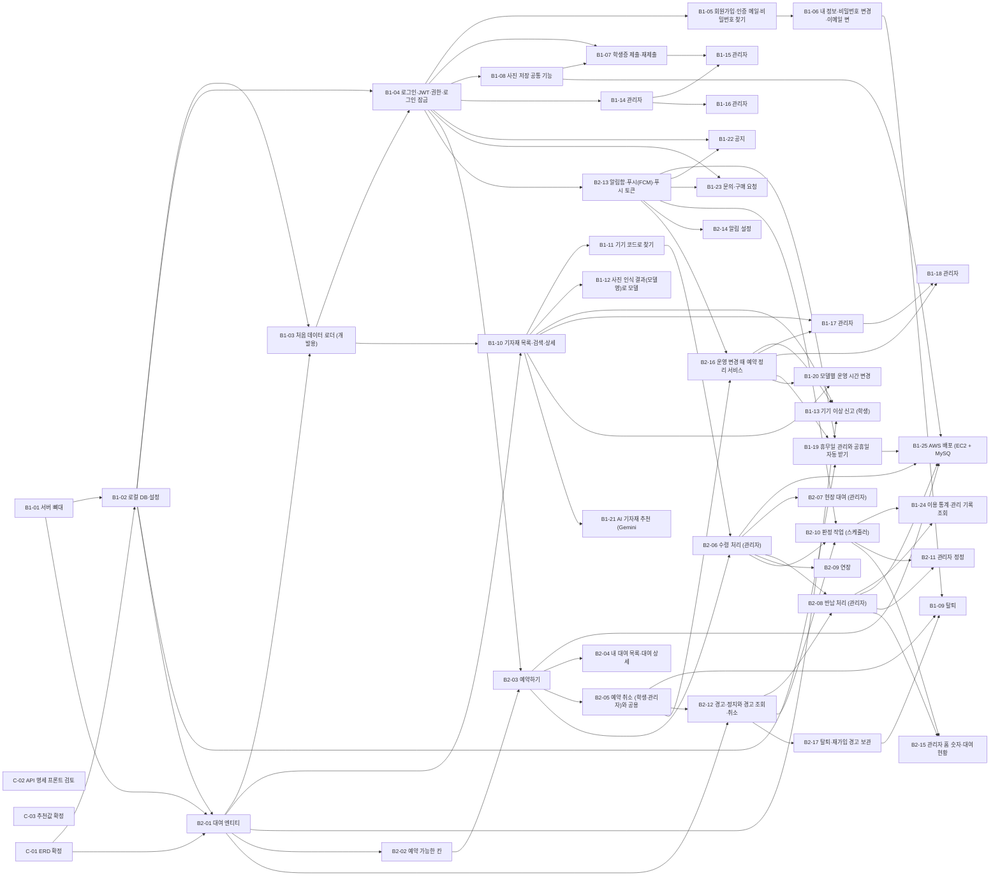

# 작업 이슈

백엔드 작업을 **이슈 하나 = PR 하나** 크기로 나눈 목록입니다. 이슈마다 파일이 하나 있고, 목적·참고 명세·만들 API·범위·제외·선행·완료 조건·확인 방법·미정 사항이 적혀 있습니다.

- 이 파일들은 **GitHub 이슈의 초안**입니다. 팀이 확인한 뒤 GitHub 이슈로 등록합니다. 제목은 파일 첫 줄(`[FEAT] B2-03 예약하기`), 본문은 파일 내용입니다. 아래 표의 라벨(작업 종류 하나 + 담당자 계정)을 붙이고 Assignees에도 담당자를 지정합니다. 등록하면 GitHub 번호(`#12`)가 생기고, 브랜치·커밋·PR은 이 번호를 씁니다([CONVENTION 4절](../CONVENTION.md#4-git-규칙)). 등록 뒤 작업 중 진행 상황과 논의는 GitHub 이슈에 남깁니다. 범위·완료 조건의 기준은 이 저장소의 이슈 파일이며, 합의된 변경은 관련 명세와 같은 PR에서 이 파일에도 반영합니다. 작업을 시작하기 전에 GitHub 이슈의 최신 합의와 이 파일이 같은지 확인하고, 다르면 팀에 먼저 알립니다.
- 번호는 [API 명세 2절](../api/README.md)과 [openapi.yaml](../api/openapi.yaml)의 API 설명에 적힌 **이슈:** 번호와 같습니다.
- **번호 순서가 작업 순서는 아닙니다.** 아래 선행 관계를 보고, 선행 이슈가 머지된 것부터 합니다.
- 이슈 하나를 끝내는 흐름은 [시작하기 7절](../시작하기.md#7-이슈-하나-끝내기).

## 각자 첫 작업

| 누가 | 첫 주에 할 일 | 공통 환경 필요 |
|---|---|---|
| 둘이 함께 | [C-01](C-01.md) ERD 확정과 [C-03](C-03.md) 추천값 확정(한 번의 회의로), [C-02](C-02.md) 프론트와 API 검토 일정 잡기 | 아니오(문서만) |
| 백엔드 1 | [B1-01](B1-01.md) 서버 뼈대를 가장 먼저 머지 → [B1-02](B1-02.md) → [B1-03](B1-03.md). 공공데이터 서비스 키 신청(B1-19)과 Gmail 앱 비밀번호 확인(B1-05)은 첫날 해 두기(승인에 시간이 걸릴 수 있음) | B1-01은 아니오, 나머지는 예 |
| 백엔드 2 | [DB 설계 6·7절](../db/README.md)과 사례를 읽고 [B2-01](B2-01.md)의 계산 클래스(대수, 다음 주 금요일, 장기 기한)를 스프링 없이 먼저 작성 → B1-01·B1-02 머지 뒤 엔티티·잠금을 붙여 PR. Firebase 프로젝트 준비(B2-13) | 계산 클래스는 아니오, 엔티티부터 예 |

"공통 환경"은 B1-01(뼈대)·B1-02(DB·엔티티)가 머지된 `dev` 브랜치를 말합니다. 그 전에는 문서 작업과 스프링 없이 시험할 수 있는 계산 코드만 할 수 있습니다.

## 서로 부르는 서비스 (먼저 약속)

두 사람 코드가 만나는 곳입니다. 이름과 인자는 추천이고, 먼저 만드는 사람이 정해 PR에 적습니다.

| 서비스 | 만드는 이슈 | 부르는 이슈 |
|---|---|---|
| `AuditLogService.record(...)` 관리 기록 | B1-02 | 관리자 기능 전부 |
| 파일 삭제 작업 저장·재시도 | B1-08 | B1-15, 프로필 사진 교체. 재시작 후 삭제 확인까지 B1-08 책임 |
| 재가입 경고·남은 정지 복원 | B2-17 | B1-15 승인 때 호출, B1-15가 연결 시험 |
| 대수 계산, 모델 행 잠금 | B2-01 | B1-10, B2-02·03·06·07·09 |
| `OperatingHoursService.hoursOn(model, date)` 그날의 운영 시간 | B1-20 (급하면 B2-02가 먼저 만들고 B1-20이 넘겨받음) | B2-01·02 |
| `StorageService` 사진 저장 | B1-08 | B1-07·15 |
| `RentalCancelService.cancel(...)` 예약 취소 | B2-05 | B1-09, B2-12, B2-16 |
| `WarningService` 경고·정지, 유효 경고 수 | B2-12 | B1-06, B1-14, B2-08·10·11 |
| `NotificationService.notify(...)` 알림 | B2-13 (알림함 저장 부분을 먼저) | 거의 모두 |
| `OperationChangeService` 운영 변경 예약 정리 | B2-16 | B1-13·17·18·19·20 (각 이슈의 "연결 작업과 확인 책임") |
| 탈퇴 경고 보관·되살리기 | B2-17 | B1-09, B1-15 |

## 선행 관계

화살표는 "앞 이슈가 머지되어야 뒤 이슈를 끝낼 수 있다"는 뜻입니다. 부분 선행(예: B1-03의 대여 예시 부분만 B2-01 필요)도 화살표로 그렸으니 이슈 파일의 "착수" 칸을 함께 보세요.

## 공동

| 이슈 | 제목 | 라벨 | API 수 | 선행 | 착수 |
|---|---|---|---|---|---|
| [C-01](C-01.md) | ERD 확정 | `📝 docs` `umckee5696` `OSJ99071` |  | 없음 | 지금 바로 (문서 작업, 공통 환경 불필요) |
| [C-02](C-02.md) | API 명세 프론트 검토 | `📝 docs` `umckee5696` `OSJ99071` |  | 없음 (C-01과 같이 해도 됨) | 지금 바로 (문서 작업, 공통 환경 불필요) |
| [C-03](C-03.md) | 추천값 확정 | `📝 docs` `umckee5696` `OSJ99071` |  | 없음 | 지금 바로 (회의, 공통 환경 불필요) |

## 백엔드 1

| 이슈 | 제목 | 라벨 | API 수 | 선행 | 착수 |
|---|---|---|---|---|---|
| [B1-01](B1-01.md) | 서버 뼈대: 프로젝트 생성, 공통 응답·예외, Swagger, Clock | `🔧 chore` `umckee5696` |  | 없음 | 지금 바로 |
| [B1-02](B1-02.md) | 로컬 DB·설정, 백엔드 1 담당 엔티티 | `✨ feat` `umckee5696` |  | [B1-01](B1-01.md), [C-01](C-01.md) | B1-01, C-01 후 |
| [B1-03](B1-03.md) | 처음 데이터 로더 (개발용) | `✨ feat` `umckee5696` |  | [B1-02](B1-02.md), 대여 예시 부분만 [B2-01](B2-01.md) | B1-02 후 |
| [B1-04](B1-04.md) | 로그인·JWT·권한·로그인 잠금 | `✨ feat` `umckee5696` | 3 | [B1-02](B1-02.md), [B1-03](B1-03.md)(가짜 계정으로 확인) | B1-02 후 |
| [B1-05](B1-05.md) | 회원가입·인증 메일·비밀번호 찾기 | `✨ feat` `umckee5696` | 3 | [B1-04](B1-04.md) | B1-04 후 |
| [B1-06](B1-06.md) | 내 정보·비밀번호 변경·이메일 변경 | `✨ feat` `umckee5696` | 3 | [B1-05](B1-05.md) | B1-05 후 |
| [B1-07](B1-07.md) | 학생증 제출·재제출 | `✨ feat` `umckee5696` | 1 | [B1-04](B1-04.md), [B1-08](B1-08.md) | B1-08 후 |
| [B1-08](B1-08.md) | 사진 저장 공통 기능, 프로필 사진, 모델 사진 | `✨ feat` `umckee5696` | 3 | [B1-04](B1-04.md) | B1-04 후 |
| [B1-09](B1-09.md) | 탈퇴 | `✨ feat` `umckee5696` | 1 | [B1-06](B1-06.md), [B2-05](B2-05.md), [B2-17](B2-17.md) | B2-17 후 |
| [B1-10](B1-10.md) | 기자재 목록·검색·상세 | `✨ feat` `umckee5696` | 2 | [B1-03](B1-03.md), [B2-01](B2-01.md)(availableNow) | B1-03 후 (availableNow는 B2-01 후) |
| [B1-11](B1-11.md) | 기기 코드로 찾기 | `✨ feat` `umckee5696` | 1 | [B1-10](B1-10.md) | B1-10 후 |
| [B1-12](B1-12.md) | 사진 인식 결과(모델명)로 모델 찾기 | `✨ feat` `umckee5696` | 1 | [B1-10](B1-10.md) | B1-10 후 |
| [B1-13](B1-13.md) | 기기 이상 신고 (학생) | `✨ feat` `umckee5696` | 1 | [B2-01](B2-01.md), [B1-10](B1-10.md), [B2-16](B2-16.md) | B2-01 후 (예약 정리는 B2-16 후) |
| [B1-14](B1-14.md) | 관리자: 학생 목록·상세 | `✨ feat` `umckee5696` | 2 | [B1-04](B1-04.md) | B1-04 후 |
| [B1-15](B1-15.md) | 관리자: 가입 승인·반려 | `✨ feat` `umckee5696` | 2 | [B1-07](B1-07.md), [B1-14](B1-14.md) | B1-07 후 |
| [B1-16](B1-16.md) | 관리자: 학생 이름·학번 수정 | `✨ feat` `umckee5696` | 1 | [B1-14](B1-14.md) | B1-14 후 |
| [B1-17](B1-17.md) | 관리자: 모델 추가·수정·운영 종료 | `✨ feat` `umckee5696` | 4 | [B1-10](B1-10.md), [B2-16](B2-16.md) | B1-10 후 (운영 종료는 B2-16 후) |
| [B1-18](B1-18.md) | 관리자: 기기 추가·상태 변경·삭제 | `✨ feat` `umckee5696` | 3 | [B1-17](B1-17.md), [B2-16](B2-16.md) | B1-17 후 |
| [B1-19](B1-19.md) | 휴무일 관리와 공휴일 자동 받기 | `✨ feat` `umckee5696` | 4 | [B1-02](B1-02.md), [B2-16](B2-16.md), [B2-13](B2-13.md) | B2-16 후 (키 신청은 지금 바로) |
| [B1-20](B1-20.md) | 모델별 운영 시간 변경 | `✨ feat` `umckee5696` | 3 | [B1-10](B1-10.md), [B2-16](B2-16.md) | B1-10 후 (예약 취소는 B2-16 후) |
| [B1-21](B1-21.md) | AI 기자재 추천 (Gemini API) | `✨ feat` `umckee5696` | 1 | [B1-10](B1-10.md) | B1-10 후 |
| [B1-22](B1-22.md) | 공지 | `✨ feat` `umckee5696` | 4 | [B1-04](B1-04.md), [B2-13](B2-13.md)(알림) | B1-04 후 |
| [B1-23](B1-23.md) | 문의·구매 요청 | `✨ feat` `umckee5696` | 8 | [B1-04](B1-04.md), [B2-13](B2-13.md)(알림) | B1-04 후 |
| [B1-24](B1-24.md) | 이용 통계·관리 기록 조회 | `✨ feat` `umckee5696` | 2 | [B2-08](B2-08.md), [B2-10](B2-10.md) | B2-10 후 |
| [B1-25](B1-25.md) | AWS 배포 (EC2 + MySQL + S3, 백업) | `🔧 chore` `umckee5696` |  | [B1-08](B1-08.md), [B1-19](B1-19.md), 핵심 흐름(B2-03, [B2-06](B2-06.md), [B2-08](B2-08.md)) | 핵심 흐름 후 |

## 백엔드 2

| 이슈 | 제목 | 라벨 | API 수 | 선행 | 착수 |
|---|---|---|---|---|---|
| [B2-01](B2-01.md) | 대여 엔티티, 대수 계산, 칸·기간 계산, 잠금 | `✨ feat` `OSJ99071` |  | [B1-01](B1-01.md), [B1-02](B1-02.md), [C-01](C-01.md) | B1-01·B1-02 후 (계산 클래스는 B1-01 전에 로컬 브랜치에서 시작해도 됨) |
| [B2-02](B2-02.md) | 예약 가능한 칸 | `✨ feat` `OSJ99071` | 1 | [B2-01](B2-01.md) | B2-01 후 |
| [B2-03](B2-03.md) | 예약하기 | `✨ feat` `OSJ99071` | 1 | [B2-02](B2-02.md), [B1-04](B1-04.md) | B2-02 후 |
| [B2-04](B2-04.md) | 내 대여 목록·대여 상세 | `✨ feat` `OSJ99071` | 2 | [B2-03](B2-03.md) | B2-03 후 |
| [B2-05](B2-05.md) | 예약 취소 (학생·관리자)와 공용 취소 서비스 | `✨ feat` `OSJ99071` | 2 | [B2-03](B2-03.md) | B2-03 후 |
| [B2-06](B2-06.md) | 수령 처리 (관리자) | `✨ feat` `OSJ99071` | 2 | [B2-03](B2-03.md), [B1-11](B1-11.md) | B2-03 후 |
| [B2-07](B2-07.md) | 현장 대여 (관리자) | `✨ feat` `OSJ99071` | 2 | [B2-06](B2-06.md) | B2-06 후 |
| [B2-08](B2-08.md) | 반납 처리 (관리자) | `✨ feat` `OSJ99071` | 2 | [B2-06](B2-06.md), [B2-12](B2-12.md) | B2-12 후 |
| [B2-09](B2-09.md) | 연장 | `✨ feat` `OSJ99071` | 2 | [B2-06](B2-06.md) | B2-06 후 |
| [B2-10](B2-10.md) | 판정 작업 (스케줄러) | `✨ feat` `OSJ99071` |  | [B2-06](B2-06.md), [B2-12](B2-12.md), [B2-13](B2-13.md) | B2-12, B2-13 후 |
| [B2-11](B2-11.md) | 관리자 정정: 노쇼 정정, 반납 시각 정정, 반납 후 파손 발견 | `✨ feat` `OSJ99071` | 3 | [B2-08](B2-08.md), [B2-10](B2-10.md) | B2-10 후 |
| [B2-12](B2-12.md) | 경고·정지와 경고 조회·취소 | `✨ feat` `OSJ99071` | 2 | [B2-01](B2-01.md), [B2-05](B2-05.md) | B2-05 후 |
| [B2-13](B2-13.md) | 알림함·푸시(FCM)·푸시 토큰 | `✨ feat` `OSJ99071` | 4 | [B1-04](B1-04.md) | B1-04 후 (알림함 저장 부분은 일찍) |
| [B2-14](B2-14.md) | 알림 설정 | `✨ feat` `OSJ99071` | 2 | [B2-13](B2-13.md) | B2-13 후 |
| [B2-15](B2-15.md) | 관리자 홈 숫자·대여 현황 | `✨ feat` `OSJ99071` | 2 | [B2-08](B2-08.md), [B2-10](B2-10.md) | B2-10 후 |
| [B2-16](B2-16.md) | 운영 변경 때 예약 정리 서비스 | `✨ feat` `OSJ99071` |  | [B2-05](B2-05.md), [B2-13](B2-13.md) | B2-05 후 |
| [B2-17](B2-17.md) | 탈퇴·재가입 경고 보관 | `✨ feat` `OSJ99071` |  | [B2-12](B2-12.md) | B2-12 후 |

## 확인 사례와 이슈

[fixtures/cases.json](../../fixtures/cases.json)의 사례 26개가 어느 이슈의 완료 조건인지입니다. 사례가 없는 규칙은 이슈의 완료 조건과 PR 검토로 확인합니다.

| 사례 | 이슈 |
|---|---|
| `AUTH-01` 학교 이메일은 @ 뒤 전체가 정확히 같아야 한다 | [B1-05](B1-05.md) |
| `AUTH-02` 인증번호는 5분 동안만 유효하고, 만료와 틀림을 구분한다 | [B1-05](B1-05.md) |
| `AUTH-03` 대여 중이면 탈퇴를 거부하고, 아니면 예약을 취소하고 경고를 6개월 보관한다 | [B1-09](B1-09.md), [B2-17](B2-17.md) |
| `RSV-01` 칸은 운영 시작부터 간격마다 만들고, 이미 시작한 칸은 보여 주지 않고 예약도 받지 않는다 | [B2-02](B2-02.md), [B2-03](B2-03.md) |
| `RSV-02` 남은 대수는 합계가 아니라 동시에 겹치는 최대치로 센다 | [B2-01](B2-01.md), [B2-03](B2-03.md) |
| `RSV-03` 반출 가능 기자재는 다음 예약 1시간 전까지만 예약된다 | [B2-01](B2-01.md), [B2-03](B2-03.md) |
| `RSV-04` 떨어진 칸은 한 번의 신청(1건)으로 묶이고, 같은 종류의 두 번째 신청은 거절된다 | [B2-03](B2-03.md) |
| `RSV-05` 주말과 공휴일에는 칸이 없고 예약도 거절된다 | [B2-02](B2-02.md), [B2-03](B2-03.md) |
| `RSV-06` 예약은 다음 주 금요일(월요일 시작 주 기준) 운영 종료까지만 잡힌다 | [B2-01](B2-01.md) |
| `LT-01` 장기 대여 반납 기한은 수령일 + 6개월의 운영 종료 시각 | [B2-03](B2-03.md) |
| `LT-02` 6개월 뒤가 쉬는 날이면 그 전 운영일로 당긴다 | [B2-01](B2-01.md) |
| `PICK-01` 수령은 운영 시간 안에만. 시작 전이라도 남는 기기가 있으면 일찍 받는다 | [B2-06](B2-06.md) |
| `PICK-02` 장기 대여 수령은 관리자가 지도교수 메일을 확인해야 된다 | [B2-06](B2-06.md), [B2-07](B2-07.md) |
| `WALK-01` 현장 대여 반납 기한은 예약 규칙과 같고, 다음 예약 1시간 전(반출 기자재)까지만 | [B2-07](B2-07.md) |
| `RET-01` 기한이 지나면 판정 작업이 연체 경고 1회, 늦게 반납해도 다시 붙이지 않는다 | [B2-08](B2-08.md) |
| `RET-02` 대여 중 스스로 신고한 파손은 경고 없음, 신고 없이 파손 반납이면 경고 1회 | [B1-13](B1-13.md), [B2-08](B2-08.md) |
| `EXT-01` 연장은 일반 대여만 한 번, 하루 대여는 그날 운영 종료까지 | [B2-09](B2-09.md) |
| `EXT-02` 2일 이상 대여 연장은 다음 주 금요일 운영 종료까지, 쉬는 날은 못 고른다 | [B2-09](B2-09.md) |
| `EXT-03` 하루 대여는 15분 전 알림, 연장하면 새 기한으로 다시 알린다 | [B2-09](B2-09.md), [B2-10](B2-10.md) |
| `NS-01` 시작 10분 뒤까지 안 받으면 노쇼, 경고는 신청 단위 1회, 같은 신청의 남은 칸은 취소 | [B2-10](B2-10.md) |
| `NS-02` 예약 시작 시각에 내줄 정상 기기가 없으면 즉시 취소하고 알림, 경고 없음 | [B2-10](B2-10.md) |
| `WARN-01` 경고 3회면 정지: 예약 취소, 보유 기기 즉시 반납 요망, 6개월은 마지막 반납부터 | [B2-12](B2-12.md) |
| `WARN-02` 관리자가 경고를 취소해 3회 미만이 되면 정지가 풀린다 | [B2-12](B2-12.md) |
| `OPS-01` 임시 휴무를 넣으면 그날 걸친 예약만 경고 없이 취소한다 | [B1-19](B1-19.md), [B2-16](B2-16.md) |
| `OPS-02` 일주일 안에 돌아올 대여의 반납일이 휴무가 되면 그 뒤 가장 가까운 운영하는 평일의 운영 종료로 늘리고 알린다 | [B1-19](B1-19.md), [B2-16](B2-16.md) |
| `UNIT-01` 기기가 점검 중이 되어 대수가 모자라면, 신청 시각이 늦은 예약만 바로 취소하고 먼저 신청한 예약은 유지한다(학생 신고와 관리자 변경 모두) | [B1-13](B1-13.md), [B1-18](B1-18.md), [B2-16](B2-16.md) |
